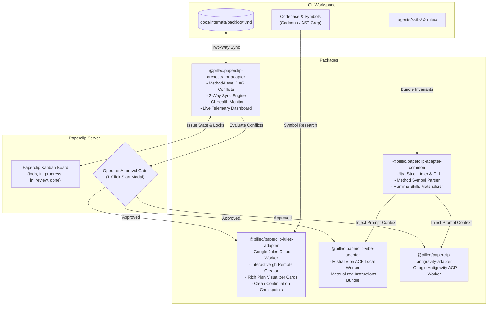

# 📎 Paperclip Multi-Lane Adapters Monorepo

[](https://github.com/Pilleo/paperclip-adapters/actions)
[](LICENSE)
[]()
[]()

Production-grade, high-performance adapters and deterministic multi-lane orchestration engine for **[Paperclip AI](https://github.com/paperclipai/paperclip)**.

---

## 🏛️ Monorepo Architecture



---

## 📦 Packages

| Package | Name | Description |
|---|---|---|
| [`packages/common`](packages/common) | `@pilleo/paperclip-adapter-common` | Shared frontmatter parsing, ultra-strict backlog validation CLI (`paperclip-backlog-lint`), method symbol parsing, label sanitization, and runtime skills materializer. |
| [`packages/orchestrator`](packages/orchestrator) | `@pilleo/paperclip-orchestrator-adapter` | Deterministic multi-lane scheduler with method-level DAG conflict matrix, two-way Git Markdown $\leftrightarrow$ Board sync, operator approval gates, and CI monitor. |
| [`packages/jules`](packages/jules) | `@pilleo/paperclip-jules-adapter` | Autonomous cloud software engineer with automatic repository discovery, interactive `gh` remote repo creation, clean continuation checkpoints, and plan cards. |
| [`packages/vibe`](packages/vibe) | `@pilleo/paperclip-vibe-adapter` | Mistral Vibe ACP adapter supporting local execution, tools execution, and materialized workspace skills bundles. |
| [`packages/antigravity`](packages/antigravity) | `@pilleo/paperclip-antigravity-adapter` | Google Antigravity ACP adapter with dynamic model discovery and native subagent support. |

---

## 🚀 Key Innovations & Features

### 1. 🎯 Method & Symbol-Level Granularity DAG Scheduling
Unlike traditional whole-file lock schedulers, the Orchestrator evaluates target symbols (`target_symbols: ["ClassName#methodName"]`). Multiple tasks touching the same large source file can safely run concurrently if their target methods are completely disjoint, preventing artificial scheduling bottlenecks while strictly avoiding merge conflicts.

### 2. 🔄 True Two-Way Git Markdown $\leftrightarrow$ Paperclip Board Sync
- Edits made directly in Git Markdown files (`docs/internals/backlog/`) instantly update issues on the Paperclip Kanban board.
- Status changes, assignments, and completions made in Paperclip UI automatically update the Markdown files and move completed issues to `resolved/`.

### 3. ☁️ Self-Healing Google Jules Cloud Workflow
- Automatically discovers local repository `origin` URLs and default branches (`master`/`main`).
- Interactively creates private GitHub repositories via `gh` CLI when starting fresh workspaces.
- Seamlessly checkpoints pending reviews, feedback, and approvals with `exitCode: 0`.
- Renders collapsible implementation plan cards and live CI check statuses with deduplicated commit SHA alerts.

### 4. 🧠 Materialized Runtime Skills & Rules Injection
Automatically extracts root invariants (`AGENTS.md`, `.agents/CODE_QUALITY.md`) and `.agents/skills/*/SKILL.md` (e.g. `add_syscall`, `ffm_safety`, `ast_grep`, `file_structure`) into structured instruction bundles for local ACP workers (Vibe and Antigravity).

### 5. 🛠️ Fast Backlog Linter CLI (`paperclip-backlog-lint`)
Scans and validates hundreds of backlog issue files in under **15 milliseconds**, enforcing date-based filenames (`issue-YYYYMMDD-HHMMSS-slug.md`), canonical severities, valid components, Gradle modules, and open question consistency.

---

## ⚡ Quickstart

### 1. Register with Paperclip Server

Add the built adapter packages to your `~/.paperclip/adapter-plugins.json`:

```json
{
  "adapters": [
    {
      "type": "orchestrator",
      "modulePath": "/path/to/paperclip-adapters/packages/orchestrator/dist/server/index.js"
    },
    {
      "type": "jules",
      "modulePath": "/path/to/paperclip-adapters/packages/jules/dist/server/index.js"
    },
    {
      "type": "vibe",
      "modulePath": "/path/to/paperclip-adapters/packages/vibe/dist/server/index.js"
    },
    {
      "type": "antigravity",
      "modulePath": "/path/to/paperclip-adapters/packages/antigravity/dist/server/index.js"
    }
  ]
}
```

### 2. Build & Test

```bash
# Install dependencies
pnpm install

# Build all packages
pnpm -r build

# Run all 340+ unit and integration tests
pnpm -r test
```

### 3. Run Backlog Linter CLI

```bash
# Validate any backlog directory
pnpm dlx @pilleo/paperclip-adapter-common lint ./docs/internals/backlog
```

---

## 🔒 Code Quality & Invariants

- **Ultra-Strict TypeScript:** `noUncheckedIndexedAccess`, `exactOptionalPropertyTypes`, and strict null checks enforced across all packages.
- **Pure Functions & State Machines:** Core DAG scheduling, quota evaluation, linter rules, and PR matching are pure, immutable, and 100% unit tested.
- **Local Pre-Commit Hook:** Automatically builds and tests all workspace packages before any local commit is created.

---

## 📄 License

Apache-2.0 © [Pilleo Team](https://github.com/Pilleo)
