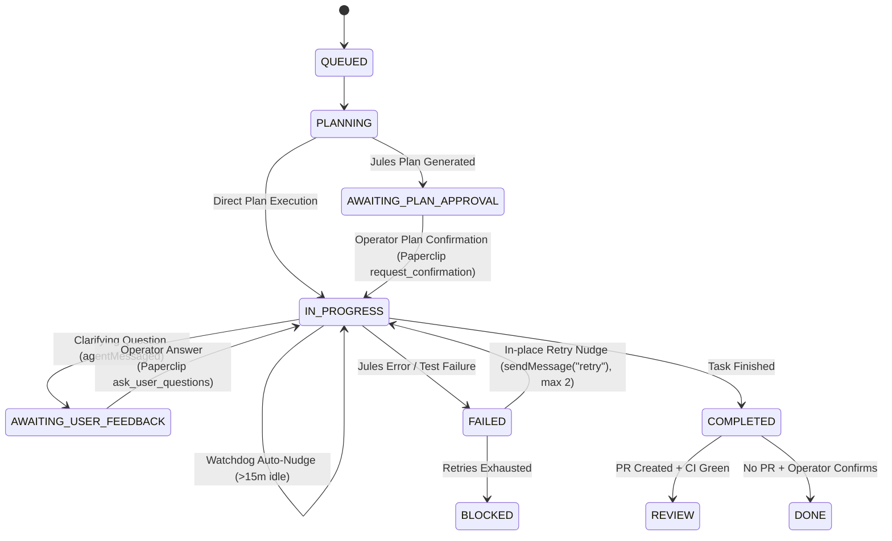

# Jules REST API & Paperclip Protocol Alignment Matrix

## Overview
This document outlines the complete architectural mapping between Google Jules Cloud Sandbox API (REST `v1alpha`) and Paperclip Agent Execution Engine.

---

## 1. Google Jules REST API Endpoints

| Jules Endpoint | HTTP Method | Payload / Response | Adapter Handler | Paperclip Mapping |
|---|---|---|---|---|
| `/v1alpha/sessions` | `POST` | `{ prompt, sourceContext, title, requirePlanApproval }` | `JulesClient.createSession()` | Initiated when an issue is assigned or reopened. |
| `/v1alpha/sessions/{id}` | `GET` | Returns session state, outputs (`pullRequest.url`), errorInfo | `JulesClient.getSession()` | Polled on heartbeats to synchronize state. |
| `/v1alpha/sessions` | `GET` | `{ sessions: [...], nextPageToken }` | `JulesClient.listSessions()` | Administrative session discovery. |
| `/v1alpha/sessions/{id}/activities` | `GET` | Paginated activities (`agentMessaged`, `planGenerated`, `progressUpdated`) | `JulesClient.getActivities()` | Mirrored into Paperclip issue activity stream. |
| `/v1alpha/sessions/{id}:approvePlan` | `POST` | Empty body | `JulesClient.approvePlan()` | Triggered when operator accepts `request_confirmation` plan card. |
| `/v1alpha/sessions/{id}:sendMessage` | `POST` | `{ prompt: string }` | `JulesClient.sendMessage()` | Relays human answers, in-place failure retries, and watchdog nudges. |
| `/v1alpha/sources` | `GET` | `{ sources: [...], nextPageToken }` | `JulesClient.listSources()` | Discovers connected GitHub repository sources. |

---

## 2. Session Phase & State Machine Transitions

---

## 3. Automation Subsystems

1. **Watchdog Stall Detection (`src/server/watchdog.ts`):**
   - Detects when an active session in `IN_PROGRESS` emits no activities for $> 15$ minutes.
   - Automatically sends `sendMessage("Status check: please continue executing the plan and report progress.")` to wake the container reasoning loop.
   - Enforces a 15-minute cooldown between nudges.

2. **In-Place Failure Recovery (`src/server/failure-recovery.ts`):**
   - Automatically recovers from `FAILED` state via `sendMessage("retry")` without creating new sessions or discarding git workspace state (up to 2 in-place attempts).
   - Unrecoverable 401/403 configuration errors immediately mark the issue `blocked`.

3. **Pure Session Lifecycle (`src/server/session-lifecycle.ts`):**
   - Strict protection against session resets: checks `wakeSource === "status_change"` on actual board transitions.
   - Immune to sticky `contextSnapshot.previousStatus` flags.
